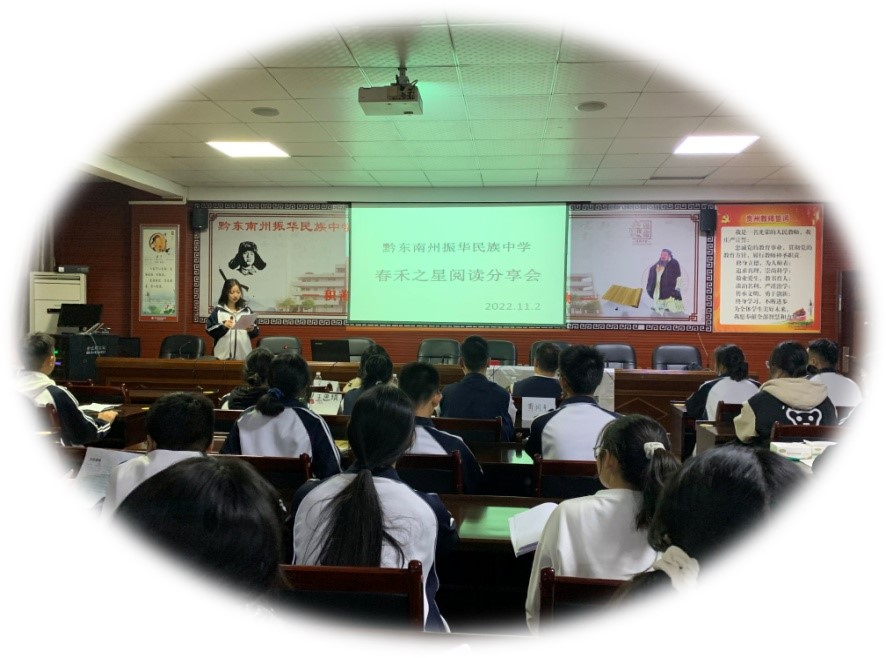

## 活动背景
$\qquad$书是人类智慧的结晶，那么，阅读就是精彩人生的开始。阅读是人类世界特有的文化传播活动，是人接受教育、发展智力、获得知识信息的最根本途径。我们作为新一代的青年，是未来社会的接班人，更应该好读书，读好书;在接受教育的同时陶冶自己的情操，滋润自己的心灵，提升自己的品味为了培养同学们读好书的良好习惯，丰富校园文化生活，形成“书香溢满校园”。对此，振华民中春禾社团于2022年11月2日开展了第一届“春禾之星”阅读分享会！  
## 比赛情况概况
$\qquad$本届分享会共有9个以个人或小组的形式参加分享会，选手们以PPT的形式辅助讲解，讲解的书籍遍及古今，当代小说、名人名著、科幻著作等。  

  
## 选手感想
$\qquad$参加此次活动，我既紧张又激动，这是一此锻炼自己的机会，而且让我领略阅读好书的乐趣。怀着紧张的心走上讲台，面对着观众。放轻松，大胆大声地说，我心里想着。再然后，自信的向观众介绍我的作品,在观众的掌声中，激动的走下台。通过这次活动，我感受到分享的乐趣，也结识了新的朋友，锻练了自己的语言能力,增强了自信心。  
::: right  
高一(8)班张零红  
:::   
$\qquad$通过这次阅读分活动，我体会到了读书的乐趣与意义，因为本次介绍的是有关科技的书本，所以我读完这本书后了解到了国家的科技技术的增长及中美两国之间的合作，这次的活动增强了我的能力锻炼我的校助,也让我的个人素质得到提升。  
::: right  
高一(8)康海星  
:::
## 学生评委感想
$\qquad$今天、很荣幸参与春禾社团中的“禾阅计划”很荣幸成为了学生评委,在这次活动中我学习到了很多知识，同时也对书籍产生了更浓厚的兴趣.也想把更多更好书籍推荐给大家。在台下,我感受到了同学们的热情大方同时,我也要学习他们的优点，非常感谢这次活动，让我学习了很多。  
::: right  
高一(8)班王思琪  
:::   
## 自我评估
$\qquad$此次活动耗时一个多月，为了让活动的效果更好，每位同学都认真完成自己的任务，有问题是必然的，但只要我们每人贡献一份自己的力量它总能迎刃而解。即使这样，计划总是赶不上计划本该是在十月底举行的，却跟学校月考时间重合，不得不往后推迟，时间的确定便成了一大难题  
### 准备不充分
$\qquad$活动的策划案制作不充分，总是因为材料的缺少，内容补及不上；海报的制作缓慢，宣传没有跟上，让很多的同学没有更深入了解活动的详情；奖项的设置问题等。  
### 活动的缺陷与不足
1. 因为时间的安排与上课冲突，以至于场上的的观众很少，就使得场上的氛围不够热烈；  
2. 因比赛分值较少，评委不方便打分且赛后统计比分较困难；  
3. 选手的准备也不太充分，拉长了比赛的用时。  
### 活动改进
$\qquad$这是我们第一次做此类型的活动，但我们不会止步于此，我们将在明年再举行一届，我们也希望在此次基础上做的更好，也是为明年定一个flag。  
1. 提前做好宣传海报，加强宣传工作，与学校领导预约，减少后续的麻烦；  
2. 确定选手的报名开始和终止时间，以备有充足的时间去安排选手的顺序；  
3. 细化每个社团工作人员的工作，确保每个工作人员对自己的工作认真负责，以减少工作疏忽，提前备好比赛需要，避免比赛时出现偏差；  
4. 会场布置时细心认真；  
5. 比赛计划和变化及时通知比赛选手，避免因为主办方原因影响选手发挥；  
6. 比赛结束后积极宣传以提高社团和活动在校的知名度，为今后的分享会活动再次举行奠定基础。  
### 活动获得
$\qquad$通过本次活动，参加的工作人员能力都得到了一个很大的磨练和提高，尤其几名新生通过本次活动更加明白了举行活动的流程和注意事项，成为今后社团活动的主力军，为今后校园活动发展提供更具有活力和能力的新篇章。  