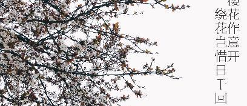
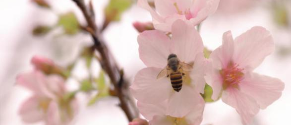
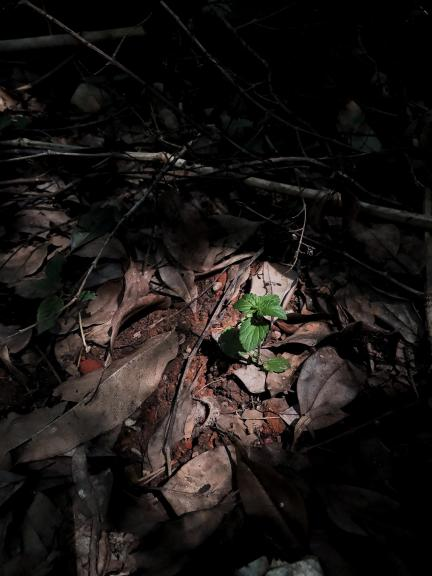
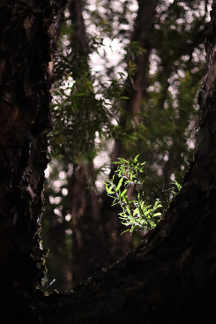
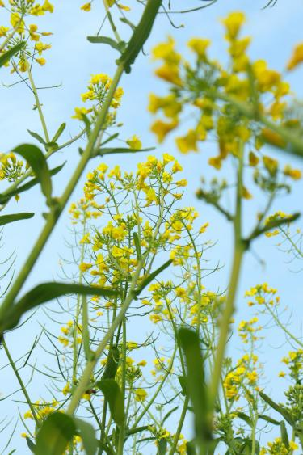
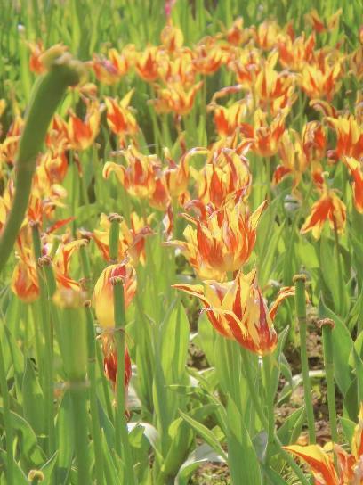
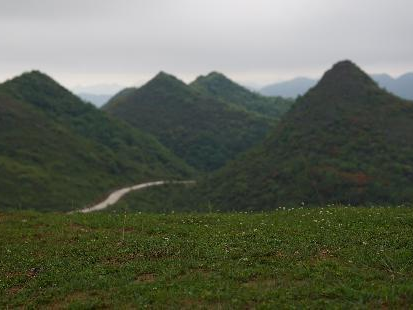
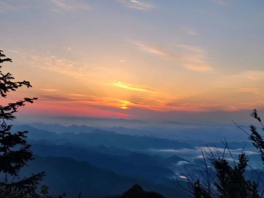
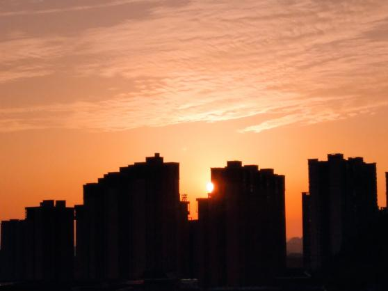

::: center  

盼望着盼望着，  
当暖阳变成烈日，  
夏天它真的来了！  
夏天是绿色的，  
绿树成荫的“绿”；  
夏天也是蓝色的，  
湛蓝天空的“蓝”；  
夏天还是白色的，  
白色T恤的“白”；  
或是橘色的也不错，  
橘子汽水的“橘”。  
而在初夏的晚风轻抚脸颊时，  
你是否还记得往昔“踏春行”  
我们一起记录过的那些春色。  

:::  

------------------------------------------------------------

我们看过樱花嫣然，见证了她与蜜蜂的美好邂逅。  

::: card-masonry

  

:::

::: center  

*《樱》| 贵州省黔西市新仁中学杨文雨（八年级）*  
*《花与蜜》| 春禾大学生志愿者张昊天*  

:::  

------------------------------------------------------------

我们在枯叶中发现生机，也在黑暗中寻找光亮。  

::: card-masonry

  

:::

::: center  

*《春天迟来》| 福建省南平市顺昌二中潘雨欣（高一）*  
*《生命不息，永有希望》| 春禾大学生志愿者王时彩*  

:::  

------------------------------------------------------------

我们沉溺于油菜花的芬芳，拥抱了郁金香的热烈。  

::: card-masonry

  

:::

::: center  

*《住进花丛里和小精灵们一起看日月星辰》| 春禾大学生志愿者李音缇*  
*《热烈》|  贵州省安顺市民族中学吴玉彩（高一）*  

:::  

------------------------------------------------------------

我们登高遥望大山的苍茫和青葱，在绵延起伏中欣赏春天的绿衣。  

::: card-masonry

  

:::

::: center  

*《颂春》 | 贵州省安顺市民族中学王棕瑾（高一）*  
*《春漫天》| 贵州省安顺市民族中学陈茜（高一）*  

:::  

------------------------------------------------------------

我们追逐春天的脚步从日出到日落，朝霞和夕阳中享受春日的浪漫。  

::: card-masonry

  

:::

::: center  

*《云开日出半掩扉》| 春禾大学生志愿者肖明雨*  
*《日暮》| 安顺市民族中学王艺瑾（高二）*  

:::  

------------------------------------------------------------

::: card

$\qquad$在本次“诗意盎然踏春行”的征集活动中，禾阅组收到45人投稿（其中1位老师，37位学生，7位志愿者），共计156份作品（其中一份绘画作品，155份摄影作品）。  
$\qquad$这个春天，我们跨过千里的路程，越过疫情的阴霾，打断时空的阻隔，以相机和画笔做窗口，共同欣赏不同的景色。  
$\qquad$即使夏来春往，也别忘记我们仍有等待春来、等待美好的那颗心，我们等你，等你一起踏春而行！  

:::

::: center

  
扫上方二维码  
查看所有征集作品  

::: right
[原文链接](https://mp.weixin.qq.com/s/ekHf5bYzB1Q3b5Ff1JnzXA)  
:::