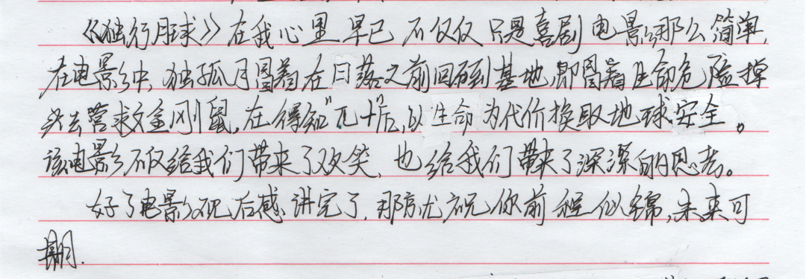
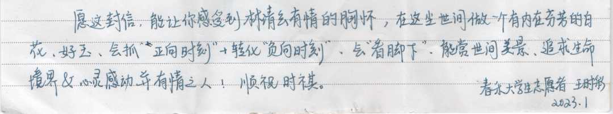
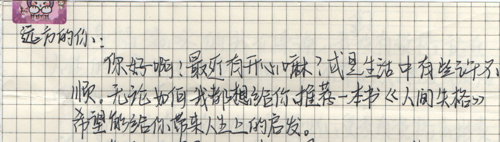
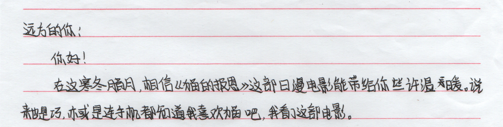
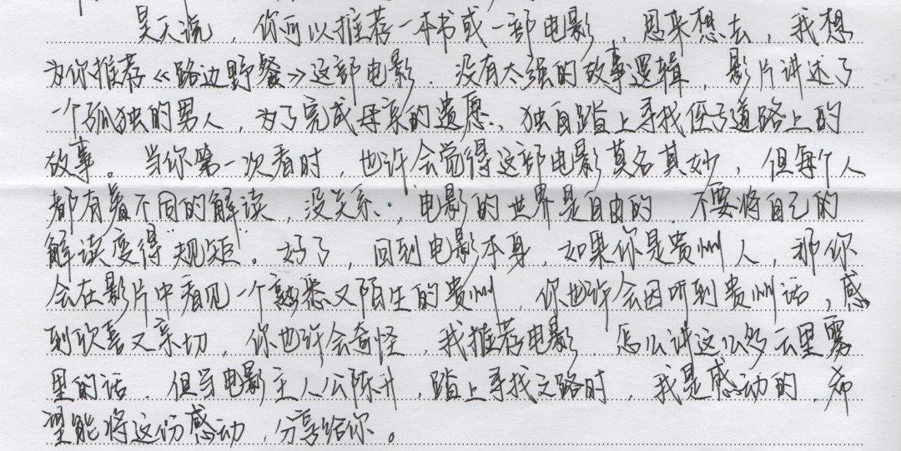
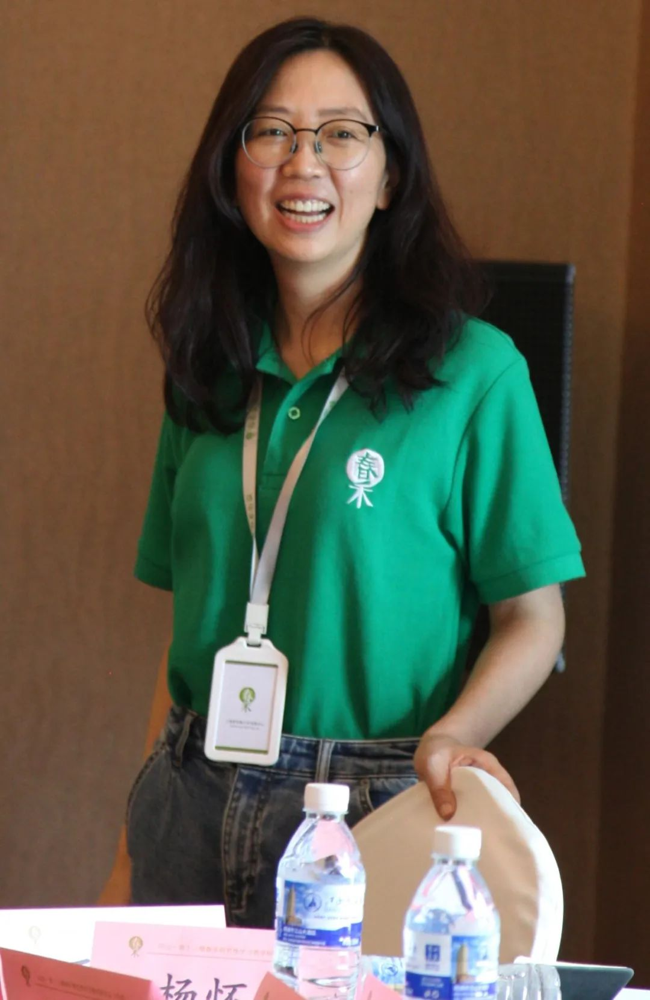
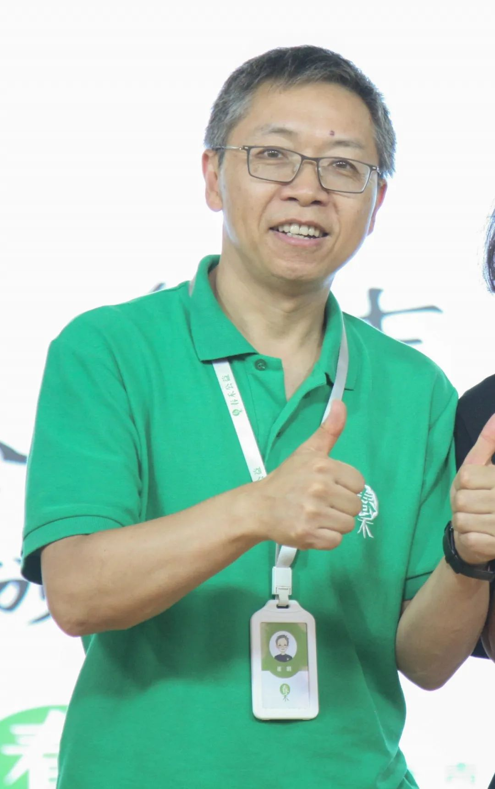

$\qquad$在临近2022年尾声之时，禾小阅发起了一场“漂流信”活动。借这次机会，我们在这个电子设备纵横的时代，以文会友，通过书信进行阅读分享，用这样的形式去领略了不同的世界。截止至三月初，交换信和禾小阅的回信都已全部寄送完毕。  

::: card-masonry cols= '2' 

:::

:::: card-grid 

::: card

:::

::: card  
亲爱的春小禾，以及所有参与到这次“漂流信”活动中的你：  
$\qquad$谢谢你们的参与，让我在这么短的时间里借由你们眼、经由你们心读了那么多的好书和电影。  
$\qquad$张小米在信分享了自己刷了N遍的《天才眼镜狗》，还说“我并不是很喜欢这种定了主题的‘春小禾’的‘漂流信’，我更愿意去以一个朋友的身份和你碎碎念，聊聊自己的生活碎片”，很真诚的声音。希望能如你信中所愿，带给更多人温暖和力量，念念不忘，必有回响。  
$\qquad$罗玉的信文里说“你一步一步走，路就一寸一寸延长”，我读到了行走的脚步不停歇。  
$\qquad$当一封封手写信文字从打开的电脑屏幕上铺展开来时，我瞬间被带回了中学时代，那时我也会给远方的笔友写信，我也期盼能收到回信；当你们的心经由你们的手写出来时，我仿佛回到了木心先生《从前慢》的少年时。  
$\qquad$原来，我们依旧可以回到那种等信、读信的美好时光，只要我们愿意。  
::: right
——“剑侠”姐
:::

::: card
$\qquad$“漂流信是一种尝试，尝试搭建一个平台，让彼此陌生的同学之间来一次陌生的打扰。对每个参与者来说，这或许是一种不同的体验，我只能说，每个人的感受会不同，不论的写信时的想法，还是收信时的心情。  
$\qquad$在某些节点上，不可避免的总想表达些什么，当下所记录的一切也将会成为成长的足迹，很感谢这次参与活动的每个春小禾以及志愿者们，谢谢大家写下自己心中的感悟，给我们带来这么多丰满而多彩的世界。”  
::: right  
——崔老师  
:::  

::: card

:::

::::

$\qquad$“人生就是一段旅程，不断在经历不同的风景、不同的人，而这次，我们一起漂流过。”再次感谢春小禾与志愿者们的参与，当然，活动的结束不代表阅读分享的结束，如果大家想要分享本次活动的心得或是交流书信阅读的感受，欢迎私戳**禾小阅QQ（2990742318）**，任何时候禾小阅都会期待着与你们的再次的联系！
$\qquad$最后，“愿所有的可爱的‘亲爱的你’，一切安好。”  

::: right
[原文链接](https://mp.weixin.qq.com/s/_O7BkhnaldAriuvtbqD-gw)  
:::