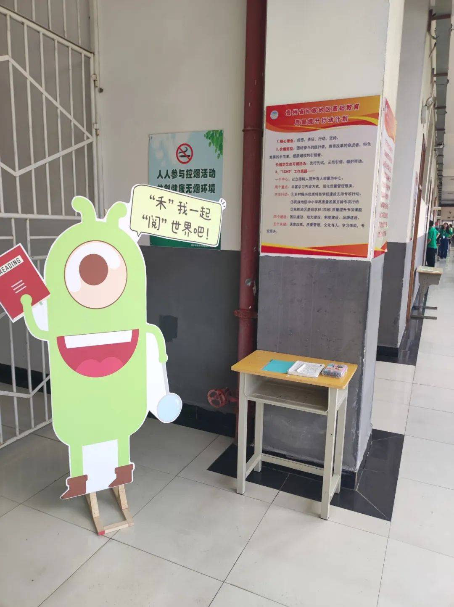
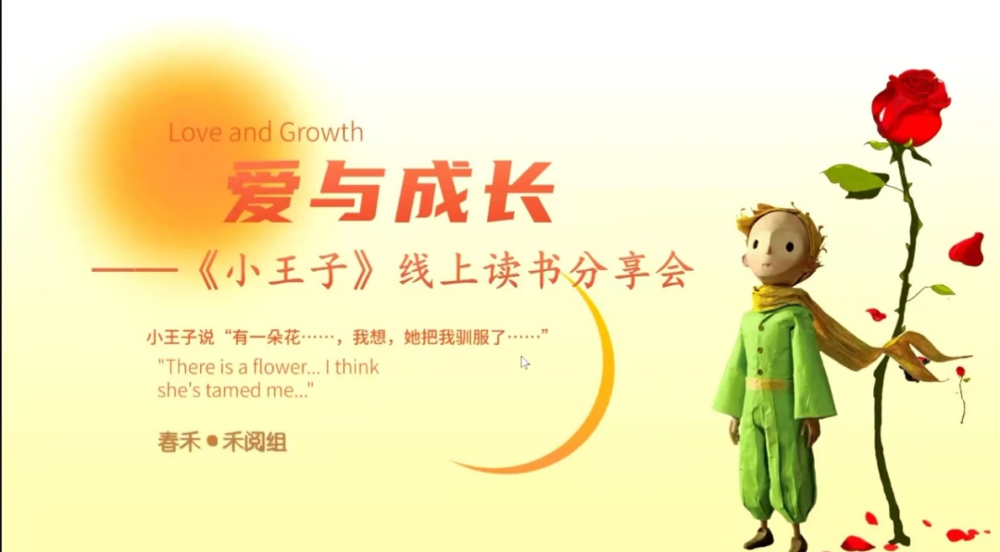
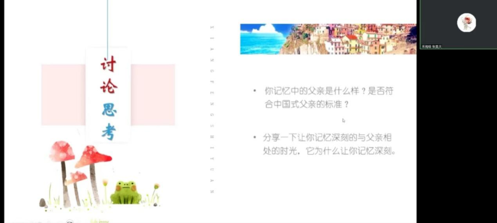

$\qquad$春小禾们好久不见呀！时隔三个月，你们是不是好奇我都在做什么呢？我可没闲着哦，我也在为2023年的暑期春禾社团交流会出一份力。现在暑期活动暂告一段落，我们也将开启新的学期。古曰：“思己之过方成才”，所以在新学期的活动开始之前，我们先回顾一下上学期的共同回忆——“共读书”线上读书分享会。  

::: center  
  
:::  

$\qquad$本次活动共有11所项目学校参与。春小禾们围绕《小王子》和《人间有至味》两本书的精彩内容，结合自身感悟和生活体验，从不同角度畅谈自己读书的所思所想，所感所悟。  

::: center  
  
:::  

$\qquad$在6月3日的《小王子》读书分享会上紫云民中的罗提珍同学分享到：“小狐狸让小王子明白了玫瑰对于它的独特，而小王子的离开也会让玫瑰想念，对于狐狸来说，从一开始它就知道他们总会分离，但依然愿意被驯服，每天非常期待小王子的到来，小王子一路上在成长，慢慢学会如何去爱、去成长……”  
$\qquad$来自黔西四中的同学也分享说：：‘驯服’大概是建立关系，两个人在一开始不认识，但当他们互相认识以后，并且为双方所付出，双方也需要，这就是‘驯服’的过程。关系的建立并不难，重要的是怎么去建立，《小王子》就是在教会我们建立关系的方法。”在同学们的讨论中，我们产生了强烈的共鸣：**生活，是爱自己所爱，不用在乎别人眼光，要相信总会有人默默支持自己，默默爱着自己；或许孤独是无法避免的，但我们要乐观积极的去看待。**  

$\qquad$日日有小暖，至味在人间。第一场“爱与成长”——《小王子》读书分享会结束后，我们又于6月17日开展了第二场“以平凡生活中的确幸”为主题的《人间有至味》读书分享会。  

::: center  
  
:::  

$\qquad$在读书会上同学们畅所欲言，刘吉俊同学谈到了他对文化的感悟：“现在很少有年轻人对老一辈文化了解，我非常喜欢以前的老文化，我认为它们的存在对现在是有意义的，正是有了一代又一代人的传承，才能让今天的我们与它们见面……”  
$\qquad$谢江同学结合生活，谈到：”中国式的父亲大多是古板，严厉的。但我父亲是一个活泼和蔼的人，平时很少对我严厉，但在我犯了错误的时候，他还是会对我予以纠正，并耐心的教导我。这对我的成长是有着很大帮助的。  
$\qquad$**“书卷多情似故人，晨昏优乐每相亲”，** 我们以书为师，可以收获知识，以书为友，可以交涉感情，书中有万千世界，我们总能找到属于自己的那一处。  
$\qquad$通过这两次的线上读书分享，同学们既在文字中感受了情怀，又在讨论中延展了思维。禾小阅希望你们 **在闲暇的时候也能在书籍和生活中寻找自己的小确幸，永远不要停下阅读的脚步。**  

::: right
[原文链接](https://mp.weixin.qq.com/s/3crA391atlM5d0_srXLanA)  
:::