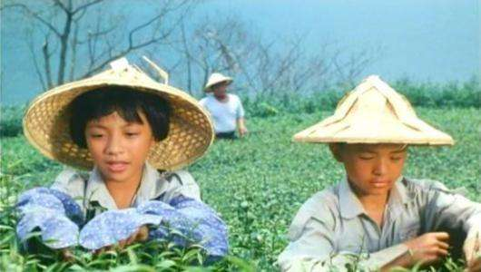
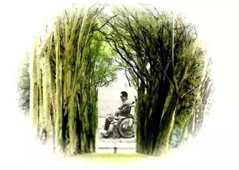
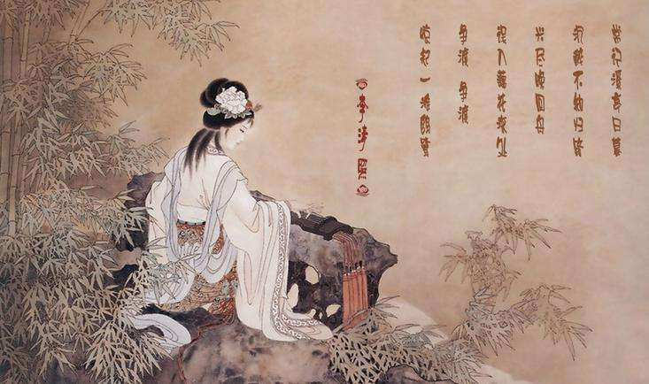
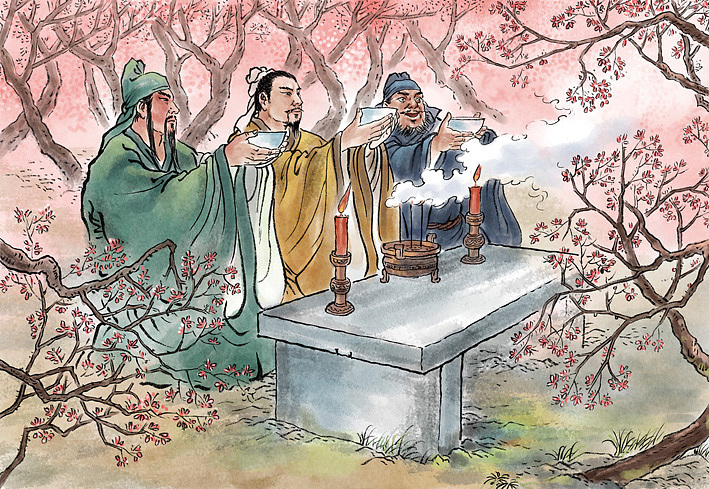
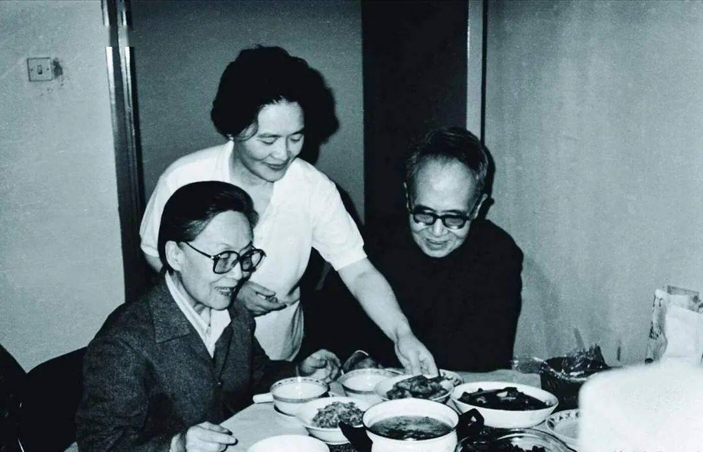

$\qquad$一群人，几本书，一次交流，以书会友。临近秋季学期末的一段时间，禾阅组织了一场“互阅书香”线上读书会，为同学们提供阅读交流平台的同时，也缓解了大家临近期末的学业压力。活动中，大家畅谈书中的大千世界，质朴而深刻的文字带来的不仅是知识的力量，还有我们所理解的生活。  
$\qquad$本次活动中，有八名同学进行了阅读分享。  

::: center  
  
:::  

$\qquad$我们从令人惋惜的天才少年古阿明开始，福建省永定二中的江宇晨同学分享了《鲁冰花》一书。小江同学说：“我一直以为古阿明最后会有一个很好的结局。一个绘画天才的少年遇到熟知他的老师，跟知己一样的老师。但是最后因为某种原因，梦想夭折。我特别惋惜他这样的人物。”在他的分享中，**我们看到了一个不畏生活困难，仍追求理想的少年，**也感受到了古阿明与郭云天老师之间深深的情谊。  

::: center  
  
:::  

$\qquad$同样来自永定二中的李清滢同学则是选择了《我与地坛》进行分享。她分享了书中的内容:《合欢树》与《秋天的怀念》都带我们体会到了**永恒不散的母爱与坚韧不拔的灵魂**，也分享了**阅读感悟**：写在白纸上普普通通的文字会令人潸然泪下，或令人激动，那是因为文字的力量是十分震撼的。  

::: center  
  
:::  

$\qquad$读《半生烟雨，半世落花：李清照传》我们则看到了在女子无才便是德的时代，这样的才女复杂的心境与情感。黔西四中的张冰清同学选择了一本风度飘飘、独具韵味的书籍，“九万里风鹏正举，风休住，蓬舟吹取三山去”饱含豪迈之感，而李清照凄凉婚姻的背后则看到了无畏的反抗精神。**“诗词的世界里多的是风流姿色的才子，少的是艰难亲婉的才女。文字是她注定要走入的风景，或者说，她注定要用文字塑造出让无数人神往的风景。”**  

::: center  
  
:::  

$\qquad$跨越时空，我们从古代来到现代。现代世界里，生活节奏加快，压力变大，我们可能常会遇到一些挫折，也会可能因此一蹶不振，从而导致影响到我们正常的生活。紫云民中的段阿彩同学对生活中的人性、情绪、自我观察入微，她推荐的《人性的优点》一书，就告诉了我们如何把握今天，远离焦虑。**或许你抱怨的同时，你正处于美丽的风景之中。**  

::: card-masonry cols= '2'

  

  

:::  

$\qquad$回归经典，《西游记》、《三国演义》是一代又一代人的回忆，来自紫云民中的刘贵、杨通贵两位同学向我们分享了**古代第一部神魔小说《西游记》**，他们用自己的视角去介绍了通过阅读对小说人物的分析，让我们再一次领略到了每个人物的精彩。同样来自紫云民中的赵天豪同学则是分享了《三国演义》，他阅读后对罗贯中笔下的历史讲解十分感兴趣，天豪同学绘声绘色地分享了他最喜欢的情节——**赤壁之战**，讲解由浅入深，令人好似身临其境。  

::: center  
  
:::  

$\qquad$最后，我们结束在紫云民中何怡怡对杨绛先生笔下的《我们仨》的分享。书籍用朴实的语言和生活化的态度向我们讲述了一个观点——只有家才是最好的港湾。小何同学在介绍中提到她的感悟，**“我体会到了亲情的价值，明白了我们要懂得感恩，我们要珍视亲情，珍视生命，珍视现在所拥有的一切”**，就这样，我们在分享中在走过了一场人世间的悲欢离合。  
$\qquad$借着阅读一本书的机会，我们可以看到书背后一个更为广阔的世界。即便当下你觉得生活很无趣或有些艰难，但其实作者们用笔端告诉你，一切往事皆如云烟。本次“互阅书香”读书会已经圆满落下帷幕，我们以分享、深刻、自由的对话体会了不同的故事，也聆听到了不一样的想法，度过了一个精彩绝伦的读书会！  
$\qquad$请相信！拿起书的时候，文字里的力量和光芒就会向我们飞奔而来！  

::: right
[原文链接](https://mp.weixin.qq.com/s/7y7IGpFAf_6TU44iwzAB6w)  
:::