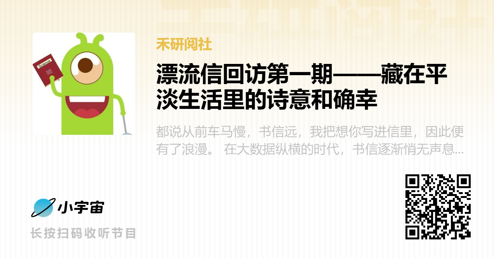

##### [收听链接](https://www.xiaoyuzhoufm.com/episodes/64565c4d94d78eb3f74446a7)
都说从前车马慢，书信远，我把想你写进信里，因此便有了浪漫。  

在大数据纵横的时代，书信逐渐悄无声息地隐出我们的生活，人们开始了一场与时间的追赶，快节奏、高冲击的信息主导了人们的交流。翻山越岭的文字，日复一日的等待，那份企盼和热忱早已不复存在，而在今日，你是否也期待过去一封书信的浪漫？

春禾公益禾阅组，组织了一场“漂流信”活动，以书信邮寄的形式联动不同地区的春禾项目学校，传递书写的温度，体验不一样的阅读分享，通过文字搭建起社交的桥梁，以笔尖联通你我，于书信阅览世界。

而在“漂流信”活动告一段落后，禾阅组特别邀请到几位活动的参与者，以访谈的形式一起交流参加活动的感想和收获，以及对于阅读分享的看法和思考。  

在第一期的访谈中，我们邀请到了安顺民族中学高二年级的马占同学和春禾常态化志愿者，彝良民族中学的小导师何利坤，由宣传组的沙洁作为主持人。  

在马占同学的漂流信中，他分享了《离骚》一诗，此《离骚》并非是语文教科书中的后半部分内容，而是课文中没有学习过的《离骚》的前半部分。除此之外，马占同学还在心中留下了一篇他自己创作的诗歌。

而利坤则是分享了一本小说《小王子》，她说“也许世界上有五千多和你一样的花，但只有你才是那朵独一无二的玫瑰”。信里传递了满满的温暖，治愈了我们的心。

这次，我们揭开信件，去了解信的主人，看看在这样充满诗意的文字背后，是怎样一个才华横溢的男孩，也看看在如此温柔的笔触背后，是怎样一个温情可爱的女孩。

##### 【关于春禾】

**上海春禾青少年发展中心**（以下简称春禾）是一家在上海注册的社会服务机构，行业主管单位是上海市浦东新区团委，登记注册机关是上海市浦东新区民政局。春禾专注于青少年创新思维、科学素养与人文情怀的培育，通过智力扶贫的方式帮助贫困地区的教育均衡发展，促进普惠教育，助力国家乡村振兴战略。

截至目前已有120多所中学加入了 **“春禾启梦计划”公益项目**，课程累计服务约400,000名师生，培训教师超过8,000人次。项目初创在贵州，目前学校已拓展至四川、云南、湖南、福建、甘肃、辽宁、陕西、新疆、内蒙古、北京和上海。这些学校基本来自偏远欠发达地区，其中70%来自县/乡镇级农村学校。

- 我们鼓励每一个好奇的提问与**探索**，无论研究的是什么！  
- 我们赞赏每一种独立的见解与**思考**，无论是否获得认同！  
- 我们聆听每一段质朴的声音与**分享**，无论是否赢得掌声！  

##### 【关于禾阅】

“阅”有“看”的意思，看书、看艺术、看生活…… “阅”也有“经历”的意思，一场有趣的实验、一段难忘的旅程、一次特别的体验。我们用“阅”的方式去认识世界、了解世界、感受世界。然而有多少值得一“阅”，又应该如何去“阅”，这些都是青少年在“阅”世界的过程中会遇到的问题。春禾致力于引导青少年发现开放、独立、自信的自己，让孩子们能够正确的“阅”世界也是这其中关键的一部分。因此，春禾决定开展“禾阅”活动。
“禾阅”以书籍为窗口，鼓励孩子们喜爱阅读，分享优质书籍，细心阅览，发现美好生活。并以此为基础，带动孩子们走出书本，勇敢尝试，用心体验，感受世界。引导孩子们用眼睛看、用心灵阅，拓宽眼界、拓展思维，乐于思考、喜于分享，成就更好的自己。

##### 【本期主播】 春禾大学生志愿者 - 沙洁

##### 【本期嘉宾】

- 春禾大学生志愿者 - 何利坤  
- 春禾项目学校，贵州省安顺市民族中学高二学生 - 马占  

##### 【本期剧透】

01:19 开场自我介绍  
01:54 参与活动的契机  
03:22 马占同学与《离骚》的故事  
05:35 志愿者何利坤与《小王子》的故事  
08:32 收到交换信后的感受  
13:05 马占同学诗歌创作分享  
14:20 志愿者何利坤阅读感悟分享  
16:43 马占同学自创诗歌朗诵  
18:26 总结结尾  
20:01 彩蛋时间！（闲聊环节）  

##### 【本期音乐】

- 片头：Flower Dance Pt.2 - DJ OKAWARI/Emily Styler  
- 片尾1：暖かい家路 (温暖家路) - 吉森信 (よしもり まこと)  
- 片尾2：风尽禾起 (春禾公益主题曲) - 罗清峋/曾以虹  

##### 【后期制作】 禾阅组工作人员 - 张昊天

##### 【了解更多】

- [**春禾公益**官网：www.spring.org.cn](https://www.spring.org.cn)  
- **春禾公益**微信公众号  
- **春禾之声**微信订阅号  
- [**春禾公益**B站账号](https://space.bilibili.com/527417804)  

##### 【联系我们】

- **禾小阅**QQ：2990742318  
- **禾阅组**邮箱：heyue@spring.org.cn