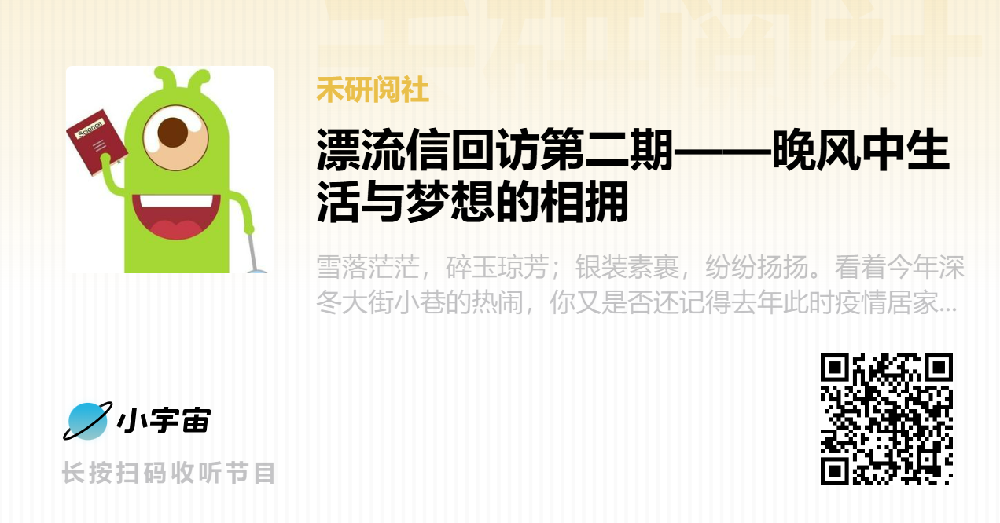

##### [收听链接](https://www.xiaoyuzhoufm.com/episodes/657b4764991e2ee608d563d3)  
雪落茫茫，碎玉琼芳；银装素裹，纷纷扬扬。看着今年深冬大街小巷的热闹，你又是否还记得去年此时疫情居家的沉寂？回忆总是敌不过时间，但幸好，我们能以图文、视频、音乐的方式来记录下过去的美好。

去年今时，禾阅工作组举办了“漂流信”的活动。“青山有约定来无”，禾阅组也在上一期的月刊中，相约等待第二期的漂流信回访，而这次 **“漂流信回访——晚风中生活与梦想的相拥”**也终于积攒了一整个春秋冬夏的期盼隆重回归！

在第二期的访谈中，我们邀请到了贵阳市第二实验中学的徐子为同学和原安顺一中的小导师李妙，由宣传组的沙洁作为主持人。

在徐子为同学的漂流信中，她分享了一本美食文化书籍《风味人间》。美食的故事对于她而言是建立情感的纽带，分享快乐的见证。书中不仅展示了全世界的风味，更让她感悟了家庭的温暖，孤独的眷念，风俗的传承；而李妙则是分享了一部电影《心灵奇旅》，她反复提到： “火花不是人生目标，而是你想要生活的那一刻。”正如无意跌落到人间，一颗棒棒糖会找到喜悦，一片树叶会点燃生的希望。

再次回顾，我们将拨开层层迷雾，到信中去了解彼此，在访谈里交换灵魂，看看从书籍跨越到电影，从梦想回归到现实，两位参与者将产生什么样的共鸣。

##### 【关于春禾】

**上海春禾青少年发展中心**（以下简称春禾）是一家在上海注册的社会服务机构，行业主管单位是上海市浦东新区团委，登记注册机关是上海市浦东新区民政局。春禾专注于青少年创新思维、科学素养与人文情怀的培育，通过智力扶贫的方式帮助贫困地区的教育均衡发展，促进普惠教育，助力国家乡村振兴战略。

截至目前已有120多所中学加入了 **“春禾启梦计划”公益项目**，课程累计服务约400,000名师生，培训教师超过8,000人次。项目初创在贵州，目前学校已拓展至四川、云南、湖南、福建、甘肃、辽宁、陕西、新疆、内蒙古、北京和上海。这些学校基本来自偏远欠发达地区，其中70%来自县/乡镇级农村学校。

- 我们鼓励每一个好奇的提问与**探索**，无论研究的是什么！  
- 我们赞赏每一种独立的见解与**思考**，无论是否获得认同！  
- 我们聆听每一段质朴的声音与**分享**，无论是否赢得掌声！  

##### 【关于禾阅】

“阅”有“看”的意思，看书、看艺术、看生活…… “阅”也有“经历”的意思，一场有趣的实验、一段难忘的旅程、一次特别的体验。我们用“阅”的方式去认识世界、了解世界、感受世界。然而有多少值得一“阅”，又应该如何去“阅”，这些都是青少年在“阅”世界的过程中会遇到的问题。春禾致力于引导青少年发现开放、独立、自信的自己，让孩子们能够正确的“阅”世界也是这其中关键的一部分。因此，春禾决定开展“禾阅”活动。
“禾阅”以书籍为窗口，鼓励孩子们喜爱阅读，分享优质书籍，细心阅览，发现美好生活。并以此为基础，带动孩子们走出书本，勇敢尝试，用心体验，感受世界。引导孩子们用眼睛看、用心灵阅，拓宽眼界、拓展思维，乐于思考、喜于分享，成就更好的自己。

##### 【本期主播】 春禾大学生志愿者 - 沙洁

##### 【本期嘉宾】

- 春禾大学生志愿者 - 李妙
- 春禾项目学校，贵州省贵阳市第二实验中学学生 - 徐子为

##### 【本期剧透】

01:24 开场自我介绍  
03:12 志愿者李妙与《心灵奇旅》的故事  
06:26 徐子为同学与《风味人间》的故事  
09:14 阅读感悟与个人经历  
14:25 漂流信内容分享  
15:51 相互祝福！  
18:11 总结结尾  

##### 【本期音乐】

- 片头：Epiphany (From "Soul"/Score) - Trent Reznor/Atticus Ross
- 片尾：Lift Me (Somehow) - Alaskan Tapes

##### 【后期制作】 禾阅组工作人员 - 张昊天

##### 【了解更多】

- [**春禾公益**官网：www.spring.org.cn](https://www.spring.org.cn)  
- **春禾公益**微信公众号  
- **春禾之声**微信订阅号  
- [**春禾公益**B站账号](https://space.bilibili.com/527417804)  

##### 【联系我们】

- **禾小阅**QQ：2990742318  
- **禾阅组**邮箱：heyue@spring.org.cn